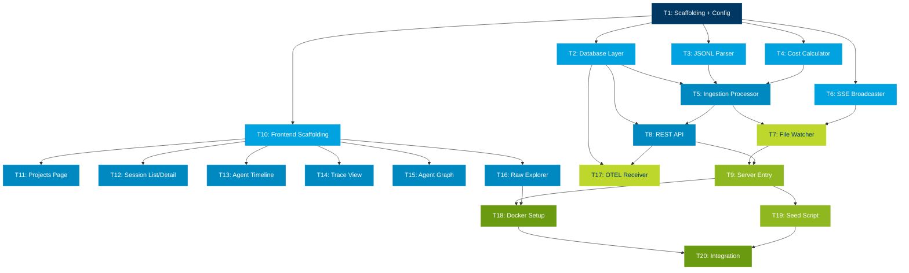

# Task Dependency & Parallelization Map

## Mermaid Diagram

## Execution Waves

| Wave | Tasks | Agents Needed | Notes |
|------|-------|---------------|-------|
| **1** | T1 | 1 | Sequential — sets up package.json, tsconfig, config |
| **2** | T2, T3, T4, T6, T10 | **5 parallel** | All independent. Backend core + frontend scaffolding |
| **3** | T5, T8, T11-T16 | **8 parallel** | Processor + API + all 6 frontend pages/components |
| **4** | T7, T17 | **2 parallel** | Watcher + OTEL receiver |
| **5** | T9, T19 | **2 parallel** | Server entry + seed script |
| **6** | T18, T20 | 1 (sequential) | Docker + final integration |

## Practical Agent Allocation

Given context limits and merge complexity, recommended grouping:

### Agent A: Backend Core (T1 → T2 → T5 → T7 → T9)
Critical path — scaffolding through working server

### Agent B: Backend Utilities (T3, T4, T6)
Parser, pricing, broadcaster — all independent, merge into Agent A's work

### Agent C: REST API + OTEL (T8 → T17)
API routes then OTEL receiver

### Agent D: Frontend Shell + Pages (T10 → T11 → T12 → T16)
Scaffolding, projects, sessions, raw explorer

### Agent E: Frontend Visualizations (T13, T14, T15)
Agent timeline, trace view, agent graph — can start after T10

### Agent F: Infrastructure (T18 → T19 → T20)
Docker, seed, integration — runs last

**Max parallelism: 5 agents in Wave 2, but practically 3-4 agents is the sweet spot** to avoid merge conflicts (Agents A+B share `src/server/`, Agents D+E share `src/client/`).
